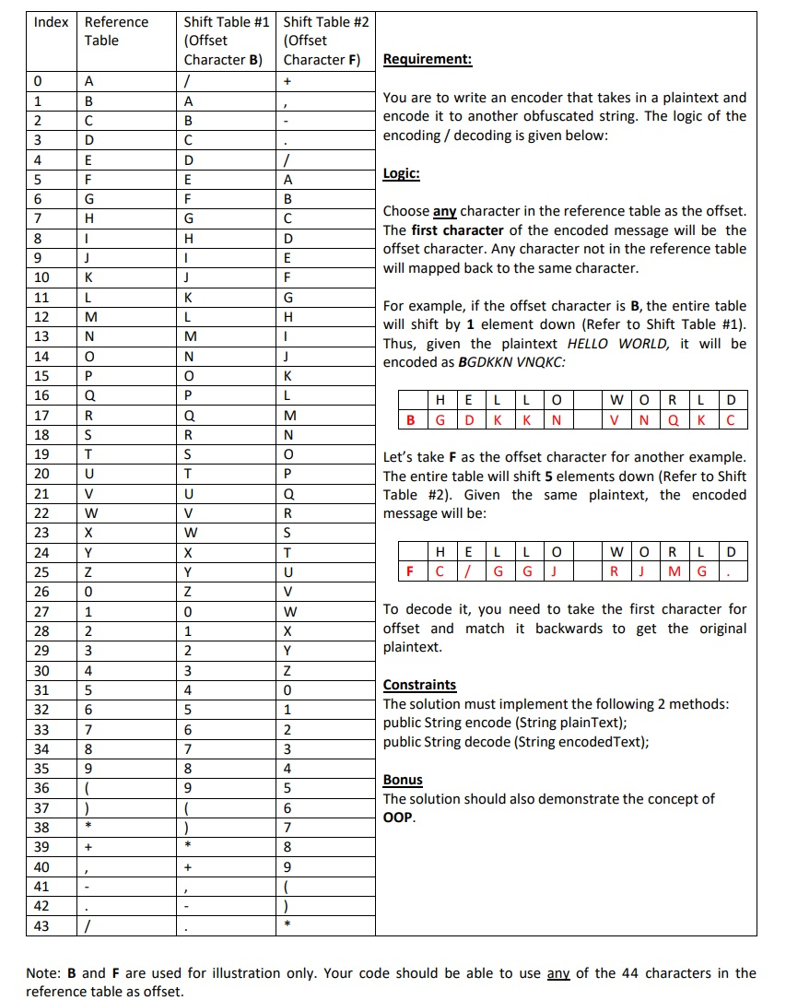
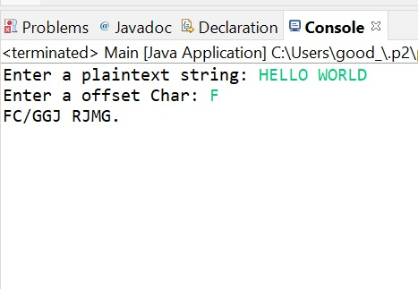
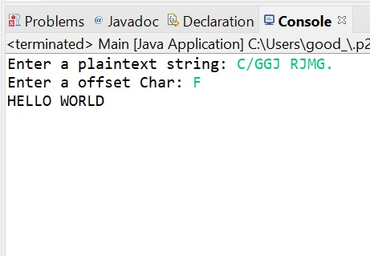

<h2 align="center">Problem Description</h2>
<h3 align="center">(Solution implemeted has the concept of OOP)</h3>
  
<h2 align="center">Encode Sample Screenshot</h2>
  
<h2 align="center">Decode Sample Screenshot</h2>
  

